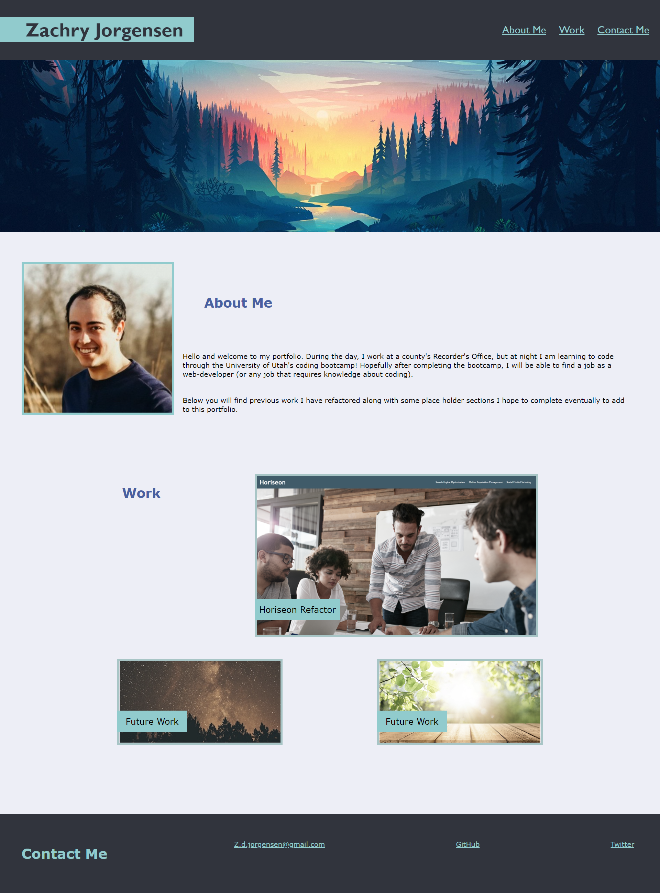
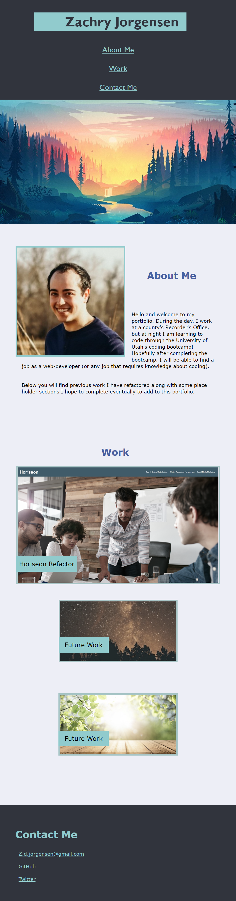

# Professional-Portfolio

<!-- ABOUT THE PROJECT -->
## About The Project

For the second challenge, `Professional Portfolio` I created a webpage from scratch. The above picutre is the webpage displayed on a monitor at full size. Below is an image showing the responsivness of the webpage. The work section needs a little work while on a monitor to look exactly how I would like it, but I was having problems understanding how `flex-box` works and getting it to do what I wanted. Besides the work section, I think my portfolio turned out well. I used previous activies for examples and guides while creating the portfolio as well as MDN.

<!-- BUILT WITH -->
## Built With
<ul>
    <li> HTML
    <li> CSS
</ul>

<!-- CONTACT ME -->
## Contact

Zachry Jorgensen - z.d.jorgensen@gmail.com

Project Link: [https://zdjorgensen.github.io/Professional-Portfolio/]

(<a href="#top">Back to Top</a>)

